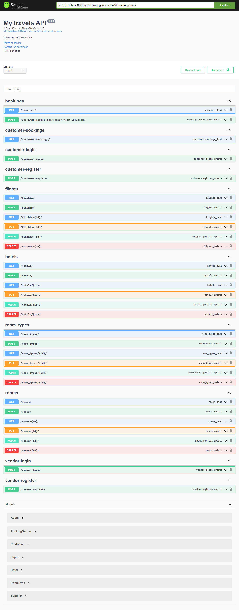

### MyTravels App.
- Online Travel Reservation.



This is a booking and management system that allows travel agencies to manage their bookings, inventory, payments, and customer feedback efficiently.
It is  designed to cater to the needs of small and large travel agencies, tour operators, and travel management companies.
The system has 3 types of users: customers, vendors/suppliers and administrators. 

Customers use the system to browse and book travel services, while administrators use it to manage bookings, inventory, payments, and customer feedback,vendors/suppliers
can post their services and get a commission as per booking.

The project uses Python and the Django Rest framework for the backend API. Users can browse available rooms, view details about a room, and book a room for a specific date range.

### Modules
* Authentication:
  - includes: customer and vendors authentication and authorization.
* Bookings
* Flights
* API

### Features:
* Vendor and Customer registration.
* Customer,Vendor authentication and authorization using JWT
* Vendors adding their services,in this case Hotels.
* Vendors creating rooms and room types.
* Customer books a room for a specific hotel.
* Downpayment automatically deducted and an invoice is generated.
* The invoice is sent to both the vendor and the customer.
* Invoice displays the downpayment and the remaining balance.
* Booking is calculated based on the date range,in this case check out and check in.
* Admin manages rooms, hotels, bookings, and users.
* Vendor manages services i.e hotels and flights.
* Booking functionality (book a room for a specific date range)
* Restricts multiple users from booking the same room at the same time.


### Installation
``` 
Clone the repository
bash
Copy code
git clone https://github.com/jeffnyalik/mytravels.git
Install dependencies
bash
Copy code
pip install -r requirements.txt
Create a .env file and set your environment variables (see .env.example for an example)

Run database migrations
```


```
bash
Copy code
python manage.py migrate
Create a superuser (admin)
bash
Copy code
python manage.py createsuperuser
Run the server
bash
Copy code
python manage.py runserver
Open your browser and go to http://localhost:8000 to view the website
Usage
Admin Panel
To access the admin panel, go to http://localhost:8000/admin and login with your admin credentials.

Searching for Rooms
On the homepage, users can search for rooms based on location and date range.
```
### Booking a Room process
* Click on a hotel to view its details, you will get a list of rooms for that specific hotel.
* Select a check-in date and check-out date for a particular room.

### NOTE
- Flight booking view module has not been implimented since it has almost the same functionality with Hotel module.
- Payment intergration is something that needs to be looked into.
- search functionality also needs to be implemented.

Contributing
Contributions are welcome for the remaining features! If you have any suggestions or would like to report a bug, please open an issue or submit a pull request.